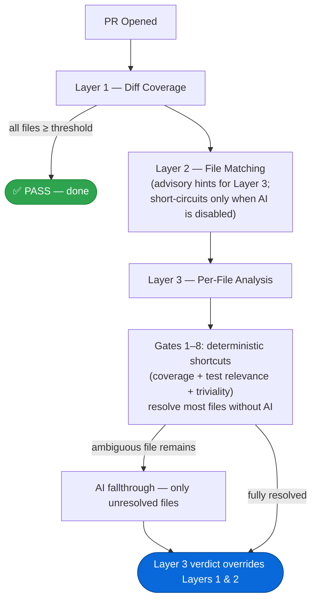
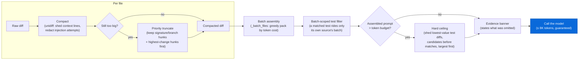

# 🧪 Test-Guard


[](https://github.com/Ostico/test-guard/actions/workflows/ci.yml)


**The only GitHub Action that answers _"Does this PR have adequate tests?"_ — not just _"What's the coverage number?"_**

Test-Guard combines diff coverage, heuristic test-file matching across 19 languages, and AI-powered per-file evaluation into a single pass/fail gate. Coverage-only tools tell you a percentage. Test-Guard tells you whether your changes are actually tested.

## How It Works

Test-Guard evaluates every source file in your PR independently. Layer 1 and Layer 2 extract data (coverage percentages, test-file matches); Layer 3 combines that data with its own analysis to produce the authoritative verdict:



**Key design principle:** Layer 3 performs a from-scratch per-file evaluation. It doesn't inherit Layer 2's verdicts — it uses L1 coverage data and L2 matched-test hints as inputs alongside test diffs and triviality detection to reach its own conclusions.

---

## The Pipeline

### Layer 1: Diff Coverage (data provider + fast exit)

Calculates the percentage of changed lines covered by existing tests, per file.

- **Mechanism:** Runs `diff-cover` against your coverage report (XML or LCOV).
- **Short-circuit:** PASS when **every** source file meets or exceeds the threshold.
- **Output:** Per-file coverage percentages forwarded to Layer 3 for use in shortcuts.
- **SKIP:** No coverage file provided or diff-cover fails. Pipeline continues.

### Layer 2: File-Matching Heuristic (data provider + fallback gate)

Matches each modified source file to a corresponding test file using naming conventions across 19 languages.

- **Silently skips:** Excluded files, test files themselves, unrecognized extensions.
- **Per-file verdicts:**
  - **PASS:** Matching test file found and modified in this PR.
  - **WARNING:** Matching test file exists in the repo but wasn't modified.
  - **FAIL:** No matching test file found.
- **Advisory mode (AI enabled):** Layer 2 never short-circuits. Its matched-test hints feed into Layer 3 but don't determine the final verdict.
- **Gate mode (AI disabled):** Layer 2 short-circuits on all-PASS, and its verdict is final.

### Layer 3: Per-File Evaluator (authoritative)

Combines coverage data from L1 and test-match hints from L2 with its own triviality detection and AI analysis. Evaluates each source file through deterministic shortcuts first, falling back to AI only for files that can't be resolved.

**Deterministic shortcuts (Gates 1–8):**

Each source file is evaluated against these gates in order. The first matching gate produces a verdict and skips AI for that file:

| Gate | Condition | Verdict | Rationale |
|:-----|:----------|:--------|:----------|
| 1 | File was deleted | SKIP | No remaining code to test |
| 2 | Nothing testable changed — trivial diff (whitespace/comments), **or** the file is in the coverage report with no executable changed lines | SKIP | There is nothing a test could cover |
| 3 | Coverage ≥ threshold (any test relevance) | PASS | Existing tests already cover the changes |
| 4 | No relevant tests in PR + no/low coverage | FAIL | No evidence of test coverage at all |
| 5 | Coverage < threshold + relevant tests exist (YES) | FAIL | Tests exist but don't cover enough |
| 6 | Coverage < threshold + ambiguous test relevance (UNKNOWN) | → AI | AI determines if changed tests actually target this file |
| 7 | No coverage data + relevant tests exist (YES) | → AI | AI cross-references test diffs against source diffs |
| 8 | No coverage data + ambiguous test relevance (UNKNOWN) | → AI | Most uncertain case — AI judges both relevance and adequacy |

**Test relevance** is a tri-state (YES / NO / UNKNOWN):
- **YES:** Layer 2 matched a test, or a changed test file's name/content references the source file.
- **NO:** No test files were changed in this PR at all.
- **UNKNOWN:** Test files were changed but none could be linked to this source file.

**AI fallthrough:** Only files reaching Gates 6–8 are sent to the AI. The prompt includes source diffs, all changed test diffs (with matched/candidate annotations), per-file coverage data, and Layer 2 hints. AI returns a per-file verdict with a confidence score — FAIL verdicts below the confidence threshold are downgraded to WARNING.

**AI failure handling:** If the API call fails, Layer 3 returns SKIP, and the final verdict falls back to Layer 1 + Layer 2 worst-wins (degraded strict mode).

---

## Verdict System

Layer 3's verdict is authoritative when it runs:

| Scenario | Final Verdict |
|:---------|:-------------|
| Layer 3 returns PASS/FAIL/WARNING | Layer 3's verdict (overrides L1 and L2) |
| Layer 3 returns SKIP (AI failure) | Worst of Layer 1 + Layer 2 (fallback) |
| AI disabled (no Layer 3) | Worst of Layer 1 + Layer 2 |

Priority within a layer: **FAIL > WARNING > PASS > SKIP**.

| Verdict | Meaning | Exit Code | Status Check |
|:--------|:--------|:----------|:-------------|
| **PASS** | All changes adequately tested | 0 | ✅ Success |
| **FAIL** | Tests missing or inadequate — blocks the PR | 1 | ❌ Failure |
| **WARNING** | Minor gaps or low-confidence AI result — non-blocking | 0 | ✅ Success |
| **SKIP** | All layers skipped (no coverage file, AI disabled, etc.) | 0 | ✅ Success |

---

## Quick Start

Layer 3 calls any OpenAI-compatible inference endpoint, so it needs one provider API key.

> **Breaking change (v2).** Test-Guard used to reach GitHub Models with your `GITHUB_TOKEN` and no external key. [GitHub retired GitHub Models on 30 July 2026](https://github.blog/changelog/2026-07-30-github-models-is-now-retired/) — the playground, catalog, and inference API are gone for all customers, and a `GITHUB_TOKEN` no longer authenticates any model endpoint. Set `ai-api-key` (and `ai-base-url` if you are not on OpenAI). Without a key, Layer 3 is skipped and the gate runs on Layer 1 + Layer 2.

```yaml
name: Test-Guard
on:
  pull_request:
    types: [opened, synchronize]

permissions:
  contents: read
  pull-requests: write
  checks: write

jobs:
  test-guard:
    runs-on: ubuntu-latest
    steps:
      - uses: actions/checkout@v4
        with:
          fetch-depth: 0

      - name: Run tests with coverage
        run: pytest --cov --cov-report=xml  # your test command

      - name: Test-Guard
        uses: ostico/test-guard@v2
        with:
          coverage-file: coverage.xml
          ai-api-key: ${{ secrets.OPENAI_API_KEY }}
```

> No special GitHub permission is needed for AI analysis — the old `models: read` scope only ever gated GitHub Models and is now inert. What Layer 3 needs is `ai-api-key`. Set `ai-enabled: 'false'` to run Layers 1–2 only.

### Provider settings at a glance

Every AI input in one place. Copy the column for your provider.

| Setting | OpenAI (default) | Google Gemini | Azure AI Foundry | Groq (free) |
|:--------|:-----------------|:--------------|:-----------------|:------------|
| `ai-base-url` | `https://api.openai.com/v1` | `https://generativelanguage.googleapis.com/v1beta/openai/` | `https://<resource>.services.ai.azure.com/openai/v1` | `https://api.groq.com/openai/v1` |
| `ai-model` | `gpt-4.1-mini` | `gemini-3.1-flash-lite` | your deployment name | `openai/gpt-oss-120b` |
| `ai-api-key` | `OPENAI_API_KEY` | `GEMINI_API_KEY` | Foundry key | `GROQ_API_KEY` |
| `ai-reasoning-effort` | `none` (stripped automatically) | `low` | depends on model | `low` |
| `ai-temperature` | `0.1` | **`1.0`** | `0.1` | `0.1` |
| `ai-max-output-tokens` | `8192` | `8192` | `8192` | `8192` |
| `ai-max-input-tokens` | `8000` | `32000` | `32000` | **`8000`** |
| Strict `json_schema` | yes | yes | yes | gpt-oss only |

Why the non-obvious values:

- **Gemini `ai-temperature: '1.0'`** — Google documents its default as strongly recommended and warns that lowering it causes looping or degraded reasoning. The `0.1` default suits OpenAI-style models and is actively wrong here.
- **Gemini `ai-max-input-tokens: '32000'`** — a 1M-token context window makes the `8000` default needlessly tight, and a shed test diff produces false warnings (see below).
- **Groq stays at `8000`** — its free tier allows only 8K tokens *per minute*, so a larger prompt trips 429s, and Layer 3 has no 429 backoff.
- **OpenAI `ai-reasoning-effort`** — `gpt-4.1` rejects the parameter with a 400; Layer 3 detects that, retries once without it, and remembers the endpoint/model pair.

### Pointing at another provider

`ai-base-url` takes any OpenAI-compatible `/v1` endpoint. Use the model ID *that provider* expects.

| Provider | `ai-base-url` | `ai-model` |
|:---------|:--------------|:-----------|
| OpenAI (default) | `https://api.openai.com/v1` | `gpt-4.1-mini` |
| Azure AI Foundry | `https://<resource>.services.ai.azure.com/openai/v1` | your deployment name |
| OpenRouter | `https://openrouter.ai/api/v1` | `openai/gpt-4.1-mini` |

Migrating from a pre-retirement config? Drop the `openai/` prefix from `ai-model` unless your new provider namespaces by publisher (OpenRouter does; OpenAI and Azure do not).

### Free options for open-source repos

GitHub no longer offers free inference. Copilot Pro remains [free for verified open-source maintainers, students and teachers](https://docs.github.com/en/copilot/how-tos/manage-your-account/getting-free-access-to-copilot-pro-as-a-student-teacher-or-maintainer), but that is an IDE/CLI entitlement — it exposes no OpenAI-compatible endpoint, so this action cannot use it. Azure AI Foundry, the official migration target, needs an Azure subscription and bills per token.

Third-party free tiers do work here:

**Layer 3 requires strict structured output.** It sends `response_format=json_schema` with `strict: true`. A model that does not support strict constrained decoding rejects the request, and because Layer 3 only retries on 413 and only falls back on 403, the batch is abandoned with a `::warning::` and those files defer to Layer 1 + Layer 2 — a working gate with no AI analysis. Check strict support before picking a free model.

| Provider | `ai-base-url` | `ai-model` | Free-tier limits |
|:---------|:--------------|:-----------|:-----------------|
| Google Gemini | `https://generativelanguage.googleapis.com/v1beta/openai/` | `gemini-3.1-flash-lite` | Per-model quotas are shown in [AI Studio](https://aistudio.google.com/rate-limit); token/min is roomy |
| Groq | `https://api.groq.com/openai/v1` | `openai/gpt-oss-120b` | 30 RPM, 1,000 req/day, **8K tokens/min**, 200K tokens/day |

Notes that decide whether these actually work:

- **On Groq, only `openai/gpt-oss-20b` and `openai/gpt-oss-120b` support `strict: true`.** Other Groq models — including `moonshotai/kimi-k2-instruct-0905` — offer best-effort JSON or tool-use only, and will fail Layer 3's strict call.
- **Groq's 8K tokens/minute free cap is tight for this workload.** Layer 3 budgets up to 8K input tokens per request, so one full-size batch can consume the entire per-minute allowance and the next batch 429s. Layer 3 has no 429 backoff, so a large PR degrades to L1+L2. Fine for small PRs; unreliable for big ones.
- **Model IDs go stale — verify before trusting one.** Gemini 2.5 was shut down ahead of its documented October 2026 date, and a retired ID returns a generic `404 models/<id> is not found for API version v1beta`, which reads like a URL bug. List what your key can actually reach: `curl "https://generativelanguage.googleapis.com/v1beta/models?key=$GEMINI_API_KEY"`.
- **Gemini 3.x cannot disable thinking — and you should not want to.** `minimal` is the floor and only "matches the no-thinking setting for most queries". Published intelligence scores for these models are *reasoning-enabled*: `gemini-3.1-flash-lite` scores 25 on the Artificial Analysis Intelligence Index versus 15 for `gpt-4.1-mini`, the baseline this prompt was tuned on — but that figure does not describe a minimal-thinking run, and Google recommends thinking for code reasoning specifically. Layer 3 is code judgment, so prefer `low` or higher and give it room via `ai-max-output-tokens` rather than flooring the effort.
- **Budget output tokens for the thought trace.** The verdict JSON is a few hundred tokens, but thought tokens count as output and truncated JSON parses as SKIP at confidence 0.0. `ai-max-output-tokens` defaults to `8192`; raise it if you raise `ai-reasoning-effort`. Gemini 3.x permits up to 65,536 output tokens, so the model is not the constraint — free-tier tokens/minute is.
- **Gemini 3.x wants `ai-temperature: '1.0'`.** Google documents its default as strongly recommended and warns that lowering temperature can cause looping or degraded reasoning. The action default of `0.1` suits OpenAI-style models but is actively wrong here.
- **Superseded guidance, kept for context: `gemini-2.5-flash` over `flash-lite`.** Layer 3 is a judgment task — map changed behaviours to test assertions across four dimensions, then calibrate confidence to evidence quality. On Artificial Analysis, Gemini 2.5 Flash without reasoning scores 14 on the Intelligence Index against 15 for `gpt-4.1-mini`, the model this action was tuned on, so it is close to parity. Flash-Lite without reasoning scores 7. The risk with a weaker model is not missed problems — those fail open to L1+L2 — but *confidently wrong* FAILs: `ai-confidence-threshold` only softens a FAIL to a WARNING when the model reports low confidence, and weak models tend to report high confidence regardless. Weaker models also more often omit a file from the response, which discards the whole batch (`_validate_batch_verdicts`). If you do run Flash-Lite, raise `ai-confidence-threshold` to around `0.8`.
- **Thinking is disabled by default.** Layer 3 sends `reasoning_effort: none`, which switches thinking off on Gemini 2.5 models and Groq's gpt-oss. This matters because Layer 3 caps `max_output_tokens` at 2048 and thought tokens count as output, so an unbounded thought trace can truncate the JSON — which parses as SKIP at confidence 0.0. Both `gemini-2.5-flash` and `gemini-2.5-flash-lite` are safe with this default. Raise it via `ai-reasoning-effort` if you want the model to think; note that thinking cannot be disabled at all on `gemini-2.5-pro` or the Gemini 3.x models.
- **Providers that reject the parameter are handled automatically.** OpenAI's `gpt-4.1` family returns a 400 for `reasoning_effort`. Layer 3 detects that specific rejection, retries once without the parameter, and remembers the endpoint/model pair — so the default OpenAI setup costs one extra request per run, not per batch.
- **Free tiers generally train on submitted prompts.** Layer 3 sends source and test diffs. Check the provider's data-use terms before pointing this at a private repository.

---

## Inputs

| Input | Default | Description |
|:------|:--------|:------------|
| `coverage-file` | _(none)_ | Path(s) to coverage report(s) — Cobertura, Clover, JaCoCo, or LCOV. Comma-separated or multiline for multiple files. Layer 1 skips if omitted. |
| `coverage-threshold` | `80` | Minimum diff-coverage % to auto-pass. Integer, `0`–`100`; other values fail the run. |
| `test-patterns` | `auto` | Source-to-test mapping. `auto` auto-detects 19 languages, or pass a JSON object to add/override patterns — see [Custom test patterns](#custom-test-patterns). |
| `exclude-patterns` | _(see below)_ | Comma-separated glob patterns to skip. Setting this **replaces** the default list. See [Excluding files](#excluding-files). |
| `extra-exclude-patterns` | _(empty)_ | Comma-separated glob patterns to exclude **in addition** to `exclude-patterns` (unioned, deduped). Add repo-specific excludes here without re-listing the defaults. |
| `ai-enabled` | `true` | Enable Layer 3 AI analysis. Truthy values: `true`, `1`, `yes` (case-insensitive); anything else disables it. |
| `ai-model` | `gpt-4.1-mini` | Model ID, exactly as `ai-base-url` expects it. |
| `ai-base-url` | `https://api.openai.com/v1` | OpenAI-compatible inference endpoint. |
| `ai-api-key` | _(empty)_ | API key for `ai-base-url`; pass it as a secret. Layer 3 is skipped when empty. |
| `ai-reasoning-effort` | `none` | Thinking budget for reasoning models: `none`, `minimal`, `low`, `medium`, `high`. Empty omits the parameter. Gemini 3.x has no `none` — use `minimal` or above. |
| `ai-temperature` | `0.1` | Sampling temperature. Gemini 3.x wants `1.0`; lowering it there causes looping per Google's docs. |
| `ai-max-output-tokens` | `8192` | Output cap per request. Raise alongside `ai-reasoning-effort`. |
| `ai-max-input-tokens` | `8000` | Prompt budget: drives batching and how much diff evidence survives. Raise on large-context providers. |
| `ai-confidence-threshold` | `0.7` | AI FAIL verdicts below this confidence become WARNING. Float, `0.0`–`1.0`; other values fail the run. |

**Default exclude patterns:**

```text
*.json, *.yml, *.yaml, *.md, *.txt, *.lock, *.toml, *.cfg, *.ini, *.sql,
migrations/**, docs/**,
*.config.js, *.config.ts, *.config.mjs, *.config.cjs, Gruntfile.js, Gulpfile.js,
conftest.py, setup.py, manage.py, noxfile.py, fabfile.py,
build.rs
```

### Excluding files

Two independent knobs:

- **`extra-exclude-patterns`** (usually what you want) — unioned **on top of** the defaults, so you add your own without re-listing anything. Deduped against the base.
  ```yaml
  extra-exclude-patterns: 'benchmarks/**,fixtures/**'
  ```
- **`exclude-patterns`** — a full **override** of the default list. Reach for this only when you need to *un-exclude* a default (e.g. analyze a `*.config.js` that's actually real source); you then own the whole list.

The two compose: the final exclude set is `exclude-patterns ∪ extra-exclude-patterns`. Files matched by either are dropped before any layer runs, so they never affect the verdict.

> The defaults stay deliberately conservative — a test-adequacy gate should never *silently* skip a whole tree of code for you. Repo-specific skips (benchmark harnesses, fixture generators) belong in `extra-exclude-patterns`, not in the shipped defaults.

**Keep `exclude-patterns` in sync with your coverage tool's own exclusions.** These are two independent lists. A changed source file that your coverage tool excludes (e.g. via `.coveragerc`, Jest `coveragePathIgnorePatterns`) is absent from the coverage report, but if Test-Guard still considers it a source file, Layer 1 fails it with **"not in coverage report."** To avoid this, add the same file to `exclude-patterns` so Test-Guard skips it too. Files with non-source extensions (`.json`, `.md`, `.yml`, `.ini`, …) are ignored automatically and need no entry.

**You do *not* need an exclude for declaration-only changes.** diff-cover reports coverage for changed **executable** lines, so a file whose diff touches only type declarations, interface members, or doc comments never shows up in its output — even at 100% coverage. Test-Guard resolves that ambiguity by reading the coverage report directly (Clover, Cobertura, JaCoCo, LCOV):

| Situation | Verdict |
|:----------|:--------|
| File **is** in the coverage report, absent from diff-cover's output | ✅ pass — *"in coverage report, but no executable lines changed"* |
| File is **not** in the coverage report at all | ❌ fail — *"not in coverage report"* (a real instrumentation gap) |

So a PR that only adds fields to a TypeScript `interface` passes without weakening the gate: add real logic to that same file later and its executable lines are measured and gated as usual.

### Custom test patterns

`test-patterns` defaults to `auto`, which uses the built-in mappings for 19 languages. To teach Test-Guard a project-specific test layout, pass a **JSON object**. Each entry maps an arbitrary id to a `src_pattern` (glob identifying a source file) and a `test_template` (glob for the expected test, with a `{name}` placeholder for the source file's stem):

```yaml
- uses: ostico/test-guard@v2
  with:
    test-patterns: |
      {
        "components": {"src_pattern": "src/**/*.tsx", "test_template": "src/**/__tests__/{name}.test.tsx"},
        "services":   {"src_pattern": "app/**/*.rb",  "test_template": "spec/**/{name}_spec.rb"}
      }
```

How it resolves — for a changed file `src/ui/Button.tsx`, the `components` entry expands `{name}` to `Button` and looks for any repo file matching `src/**/__tests__/Button.test.tsx`:

- test file exists **and** changed in this PR → **PASS**
- test file exists but **not** changed in this PR → **WARNING**
- no matching test file → **FAIL**

Rules:

- Custom entries are **merged on top of** the built-in defaults — you keep auto-detection for every other language. Reusing a default id (e.g. `python`) overrides just that entry.
- `test_template` **must** contain the `{name}` placeholder, and both fields must be strings — otherwise the run fails with a configuration error.
- Globs use `fnmatch` semantics (`*` matches path separators too); `**` is conventional, not special.

**Variant and multiple test files.** Put a `*` next to `{name}` to match qualifier-suffixed test names, and note that a source can bind to **several** test files at once (unit + integration + e2e) — all matched tests are reviewed together:

```yaml
test-patterns: |
  {
    "php": {"src_pattern": "lib/**/*.php", "test_template": "tests/**/{name}*Test.php"}
  }
```

For `GetSearchController.php` this matches **both** `GetSearchControllerTest.php` and `GetSearchControllerReplaceUndoIntegrationTest.php`. This is how you cover non-standard names (e.g. `…UnitTest`, `…IntegrationTest`, `…RealSqlTest`) that the exact-match defaults miss — either widen the template with `*`, or add a precise entry per convention. Names that encode no source at all (Rust `#[cfg(test)]`, feature-named suites) can't be matched by any template; those stay unmatched and are size-bounded automatically.

---

## AI Provider Setup

Layer 3 calls an OpenAI-compatible inference endpoint over the `openai` Python SDK. It previously used GitHub Models, which GitHub retired on 30 July 2026; there is no `GITHUB_TOKEN`-authenticated replacement, so you now supply a provider key.

### Requirements

1. **`ai-api-key`** set to a provider key, passed as a repository or organization secret.
2. **`ai-base-url`** matching that provider (defaults to OpenAI). Azure AI Foundry is GitHub's own recommended destination for retired GitHub Models workloads.
3. **`ai-model`** using the ID that provider expects — see the provider table in Quick Start.

Batching still targets ~8K input tokens per request, which keeps per-run cost low on metered providers.

> Requests are billed by whichever provider you configure, not by GitHub. GitHub AI Credits apply to Copilot, and Copilot exposes no OpenAI-compatible endpoint this action can call.

### Troubleshooting

| Symptom | Cause | Fix |
|:--------|:------|:----|
| 410 `github_models_retirement_brownout` | Config still points at `models.github.ai` | Set `ai-base-url` + `ai-api-key`; that service was retired 30 Jul 2026 |
| Layer 3 skipped with an `ai-api-key` warning | No provider key configured | Set `ai-api-key` to a secret, or `ai-enabled: 'false'` to silence it |
| 401 / 403 "Incorrect API key" | Key does not match `ai-base-url`, or `GITHUB_TOKEN` was passed | Use a key issued by that provider |
| 404 "model does not exist" | Model ID carries the wrong prefix | OpenAI/Azure: `gpt-4.1-mini`. OpenRouter: `openai/gpt-4.1-mini` |
| 413 "Request body too large" | Diff exceeds model token limit | Automatic — smart batching handles this |
| Intermittent 429 errors | Rate limit exceeded | Reduce PR size or use `ai-enabled: 'false'` for low-priority PRs |

---

## AI Architecture

Layer 3 budgets each request to **8K input tokens**. A naive implementation hits that wall constantly on real PRs — Test-Guard avoids it with three layers working together: **compaction** (shrink each diff without losing signal), **batching** (group files so a call never exceeds the cap), and **matching** (only attach the test diffs that actually belong to this batch).



### Diff Compaction

Every diff is compacted before it ever reaches a prompt (`src/layer3_ai.py`):

- **Context ladder:** context lines (unchanged code around a change) are the first thing dropped — 3 lines → 1 → 0 — before any *changed* line is touched. Changed lines are the actual signal; context is filler.
- **Priority truncation:** when hunks still don't fit, they aren't dropped in file order — hunks introducing a signature, branch, or the most changed lines are kept first; boilerplate goes first.
- **Test diffs get more room:** test files get a 1.6× larger character budget than source files, because judging test adequacy is the whole point of Layer 3.
- **Evidence-Completeness banner:** if anything was dropped, the prompt says so explicitly (`## ⚠️ Evidence Completeness` — N of M hunks shown, % of test hunks omitted) and tells the model to treat omitted code as unknown rather than assume it's fine.

Reproducible before/after numbers — including a real 29-file PR, both a raw-token axis and a signal-retention axis (to catch a "shrink" that just deletes everything) — live in [`benchmarks/`](benchmarks/README.md).

### Smart Batching

When a PR touches many files or has large diffs, Test-Guard splits work into batches that fit within a **hard-guaranteed** per-call token budget (~6.1K user-prompt tokens, real GPT tokens via `tiktoken` when installed).

- **Per-file cost:** compacted source diff + its matched test diffs + per-entry overhead.
- **Greedy packing:** files are packed into the current batch until adding the next file would exceed the budget, then a new batch starts.
- **Batch-scoped test matching:** a test file matched to a source (Layer 2) travels **only** with that source's own batch — it no longer rides every batch in the PR. Only genuinely unmatched tests (name doesn't correlate to any source) remain "candidates" attached everywhere, and even those are size-bounded.
- **Multi-test-per-source:** one source can match *several* test files at once — e.g. `FooTest` + `FooIntegrationTest` — all of them travel with that source's batch. Configure qualifier-tolerant patterns for this via [custom test patterns](#custom-test-patterns) if your defaults don't already cover it.
- **Hard ceiling (final guarantee):** after assembly, if a batch prompt still exceeds the token budget, the lowest-value test diffs are shed one at a time (unmatched candidates before matched tests, largest first) until it fits. This is the backstop that makes the 8K limit unbreakable regardless of language or naming convention.
- **Oversized single files:** a file that exceeds the budget alone gets its own batch — the retry path handles it with tighter diff truncation.

### Model Fallback Chain

When using the default model (`openai/gpt-4.1-mini`), Test-Guard automatically falls back to smaller models if the current model becomes unavailable:

```
openai/gpt-4.1-mini → openai/gpt-4.1-nano
```

- **403 (model forbidden):** Escalates to the next model in the chain. If all models are exhausted, remaining files get SKIP verdicts.
- **413 (request too large):** Retries the same model with tighter diff truncation (3K chars max). If still too large, reports the error for that batch.
- **Custom model:** When you set `ai-model` to a non-default value, no fallback chain is used — only your specified model is tried.

---

## Reporting

Test-Guard reports results in two places:

1. **PR Comment:** Markdown report with per-layer results and a per-file verdict table.
2. **Check Run:** A **Test-Guard** check appears in the PR's checks tab. Can be set as a required status check to block merges.

### Example Output

```markdown
## 🧪 Test-Guard Report

**⚠️ WARNING** — Test coverage has minor gaps — review recommended.

### Coverage Analysis: ❌ FAIL
Changed lines: 45% covered (threshold: 80%)

| File | Verdict | Reason |
|---|---|---|
| `src/auth.py` | ✅ pass | 92% diff coverage ≥ 80% threshold |
| `src/billing.py` | ❌ fail | 25% diff coverage < 80% threshold |
| `src/new_feature.py` | ❌ fail | not in coverage report |

### Test File Matching: ❌ FAIL
File matching: 1 pass, 1 fail

| File | Verdict | Reason |
|:-----|:--------|:-------|
| `src/auth.py` | ✅ pass | Test modified: tests/test_auth.py |
| `src/billing.py` | ❌ fail | No matching test file |

### Per-File Evaluation: ⚠️ WARNING
Evaluated 3 files: 1 via AI (1 batch), 2 via shortcuts.

| File | Verdict | Reason |
|:-----|:--------|:-------|
| `src/auth.py` | ✅ pass | shortcut → coverage ≥ threshold |
| `src/utils.py` | ⏭️ skip | shortcut → trivial whitespace/comment change |
| `src/billing.py` | ⚠️ warning | AI: discount logic partially covered (confidence: 62%) |

**Result: ⚠️ WARNING**
```

---

## Supported Languages

Layer 2 auto-detects test files for 19 languages:

| Language | Test conventions |
|:---------|:----------------|
| Python | `tests/test_{name}.py`, `**/{name}_test.py` |
| JavaScript | `**/{name}.test.js`, `**/{name}.spec.js`, `**/__tests__/{name}.js` |
| JSX | `**/{name}.test.jsx`, `**/{name}.spec.jsx`, `**/__tests__/{name}.jsx` |
| TypeScript | `**/{name}.test.ts`, `**/{name}.spec.ts`, `**/__tests__/{name}.ts` |
| TSX | `**/{name}.test.tsx`, `**/{name}.spec.tsx`, `**/__tests__/{name}.tsx` |
| PHP | `tests/{name}Test.php` |
| Go | `**/{name}_test.go` |
| Java | `**/{name}Test.java` |
| Kotlin | `**/{name}Test.kt` |
| Ruby | `**/{name}_spec.rb`, `**/test_{name}.rb` |
| Rust | `tests/{name}.rs` |
| C# | `**/{name}Tests.cs`, `**/{name}Test.cs` |
| Swift | `**/{name}Tests.swift`, `**/{name}Test.swift` |
| Scala | `**/{name}Spec.scala`, `**/{name}Test.scala` |
| C | `**/test_{name}.c` |
| C++ | `**/test_{name}.cpp`, `**/test_{name}.cc`, `**/test_{name}.cxx` |
| Elixir | `test/**/{name}_test.exs` |
| Dart | `test/**/{name}_test.dart` |
| Lua | `**/test_{name}.lua`, `**/{name}_spec.lua` |

---

## Supported Coverage Formats

Layer 1 uses [diff-cover](https://github.com/Bachmann1234/diff-cover), which auto-detects:

| Format | Extension | Detection |
|:-------|:----------|:----------|
| Cobertura | `.xml` | `<coverage>` root with `<packages>` child |
| Clover | `.xml` | `<coverage>` root with `<project>` child |
| JaCoCo | `.xml` | `<report>` root with `<package>/<sourcefile>` structure |
| LCOV | `.info` | Any non-XML file |

### Docker / Container Path Support

When tests run inside a Docker container (or any environment with a different filesystem root), coverage XML files record container-internal absolute paths like `/var/www/app/lib/AuthCookie.php`. These paths don't exist on the GitHub Actions runner, causing diff-cover to find zero file matches.

**Test-Guard fixes this automatically.** Before invoking diff-cover, Layer 1 detects the coverage format and normalizes paths:

| Format | How it works |
|:-------|:-------------|
| **Clover** | Reads `<file name="...">` paths, suffix-matches against PR file list to detect the container prefix (e.g., `/var/www/app/`), rewrites paths to relative. |
| **Cobertura** | Checks `<class filename="...">` — if absolute, detects the prefix and rewrites to relative. If already relative (e.g., pytest-cov output), no action. |
| **JaCoCo** | Uses diff-cover's built-in `--src-roots` handling. |
| **LCOV** | No XML normalization possible — ensure paths are relative in your LCOV output. |

**Zero configuration required.** The prefix is auto-detected by matching coverage file paths against the PR's changed files. A `::warning::` annotation is emitted when normalization activates so you can verify it's working.

---

## Examples

### Coverage + heuristics + AI (default)
```yaml
- uses: ostico/test-guard@v2
  with:
    coverage-file: coverage.xml
```

### Heuristics + AI only (no coverage file)
```yaml
- uses: ostico/test-guard@v2
# Layer 1 skips, Layer 3 shortcuts use test relevance only
```

### Heuristics only (no AI)
```yaml
- uses: ostico/test-guard@v2
  with:
    ai-enabled: 'false'
# Layer 2 becomes the gate (short-circuits on all-PASS)
```

### Strict threshold with AI
```yaml
- uses: ostico/test-guard@v2
  with:
    coverage-file: coverage.xml
    coverage-threshold: '95'
    ai-confidence-threshold: '0.8'
```

### Multiple coverage files (e.g. PHP + JS)
```yaml
- uses: ostico/test-guard@v2
  with:
    coverage-file: |
      php-coverage.xml
      js-coverage.xml
```

Comma-separated also works: `coverage-file: 'php-coverage.xml,js-coverage.xml'`

---

## Support

If Test-Guard is useful to you, consider supporting its development:

[](https://github.com/sponsors/Ostico)
[](https://paypal.me/Ostico)

---

## License

MIT
